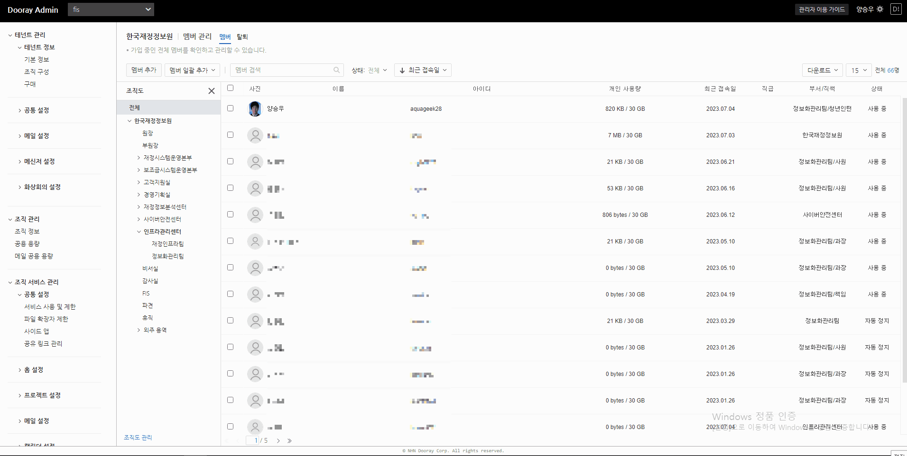

# Internship

안녕하세요 ! 🙋‍♂️   

저는 기획재정부 산하 공공기관에서 인턴쉽을 진행하였는데요,

 

저는 이 곳에서 **내부 ERP와 외부 클라우드 서비스(Dooray!) 데이터 연동 자동화 프로그램** 개발을 담당하였습니다. 

 

저는 정보화관리팀에서 이 프로그램을 만들면서 회사 내부의 ERP 시스템에 대한 업무 파악을 하였고,  

클라우드에 관심이 생겨 < AWS Certified Solutions Architect - Associate > 자격증까지 취득하게 되었습니다.

 

저는 이 프로그램을 만들면서 제가 학부 시절에 배웠던 것들을 십분 적용하고자 

1. Algorithm
2. Security
3. Parallelism
4. Design Pattern

등을 프로그램에 녹여내고자 노력하였으니 재미있게 봐주시면 감사하겠습니다. 🐣  

 

그 과정에서 제가 설계한 **Design Pattern - Singleton**의 특징 때문에 프로그램에 버그가 있는 줄 알고 며칠을 고생한 적도 있었고,   

**Algorithm**의 중요성을 느꼈으며, **Security**를 처음으로 고민해보았고, **Parallelism**의 방법으로 Thread-programming에  

도전하는 계기가 되었던 프로젝트였습니다.

 

프로젝트는 1차 시기와 2차 시기로 나누어 진행하였으며,  

1차 시에는 기능 위주로 먼저 코드를 작성하고, 2차 시에는 위의 4 가지를 적용하며 속도를 단축하도록 하였습니다.  

 

프로젝트 자료는 인턴쉽 마지막날에 발표한 자료이므로 최신화된 자료이지만,   

아래에 첨부한 구현 화면들은 보안상 1차 시에 구현한 화면들을 사용하였으며 모든 데이터들은 대치, 생략 및 변환한 데이터입니다. 🍀 

 

고맙습니다.

 

---

 

# 🔥 프로젝트 소개

 

##  🐶  부서 생성 화면

 

##  🐝 멤버 생성 화면

 

##  🦊 부서 적용 화면

 

##  🐻 프로필 이미지 적용 화면

---